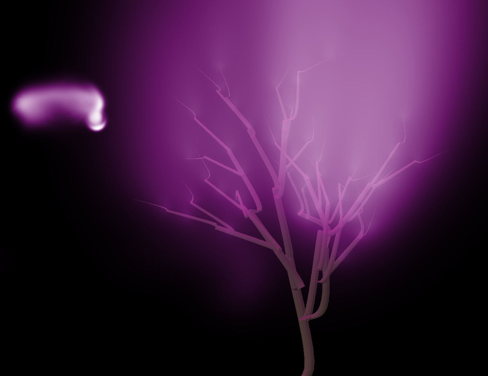
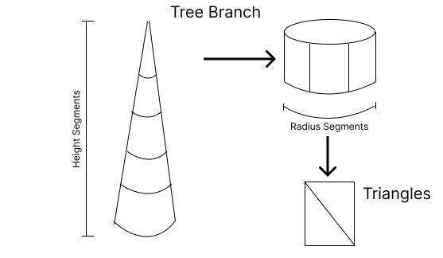

# A Simulated Growth Emitting Glowing Particles

## Member

- Pipat	Saengow		6232024821
- Siri 	Thammarerkrit		6232029021

# Demo
The demo is available for a limited-time at [DEMO](https://storage.googleapis.com/pipat-public-temp-storage/rcg-final/index.html)\

Best viewed on a Desktop with a capable GPU.

# Description

We developed a WebGL application that produces a procedurally generated Tree. From that tree, glowing smoke is emitted and its movement simulated using the GPU fluid simulation we developed.

You can click-and-drag to interact with the smoke in real-time. If the smoke is too much, you can adjust the wind speed to clear out the smoke. Refresh the page if you want a different tree. Scale the window size and refresh if the simulation runs too sluggish. Dragging the mouse gives smoke an initial velocity.

# Contribution
The work is divided into two parts: the glowing particle, and the tree. Pipat did the glowing particle part, Siri did the Tree part.

|Member name | Roles|
|------------|------|
|Pipat| Implement the fluid simulation and the smoke rendering. Setup the build system for the project. Compose smoke, user-input, and tree together. |
|Siri| Study Mesh Geometry of Three.js. Rewrite Tree Generating Code. Write new tree geometry generator. Attempt adding texture. Add leaf spot to tree. Add lighting sources. Add realistic lighting from gas |

# Detail and Improvement from Existing Work

## THREE.Tree (Siri)
from [THREE.Tree](https://github.com/mattatz/THREE.Tree)
The code was written 7 years ago with the old version of Three.js.

I read all the code and understood it, then rewrote the old code with a new version of Three.js and cut some irrelevant code from it. After that, the most difficult part was geometry. The geometry version of Three.js has been changed. I used THREE.BufferGeometry instead of THREE.Geometry. I calculated the face normal and created  triangles by myself.  Finally, I added some functions that benefit using a tree as a gas emitter and add texture to the tree.

Tree is the generation of Branches. Each branch contains Height segments, each height segment contains radius segments. Then, a segment has 4 vertices which can create 2 triangles within it.   
	Now, since the tree and the fluid simulation’s lightning does not interact with each other. It will look bad. So I add a purple light source at the emission points. This makes the scene blend together well and look more realistic.

## Smoke Simulation (Pipat)

I want to study how to implement a fluid simulator, so all the fluid simulation code is implemented from the ground-up by me. Following resources were used by me to learn how to implement it:

- \[Stam\] [Jos Stam, Real-Time Fluid Dynamics for Games](https://www.dgp.toronto.edu/public_user/stam/reality/Research/pdf/GDC03.pdf?utm_source=pocket_saves)
- \[Bridson and Matthias\] Robert Bridson and Matthias Müller-Fischer, [FLUID SIMULATION SIGGRAPH 2007 Course Notes](https://www.cs.ubc.ca/~rbridson/fluidsimulation/fluids_notes.pdf?utm_source=pocket_saves)
- \[Shehata\] Omar Shehata, [How to Write a Smoke Shader](https://gamedevelopment.tutsplus.com/tutorials/how-to-write-a-smoke-shader--cms-25587)

First in the beginning, I performed risk-analysis to ensure that the project is possible and could be finished on time. The implementation of GPU-based WebGL fluid simulation is possible as demonstrated by [Rachel Bhadra et al.](https://rachelbhadra.github.io/smoke_simulator/index.html) and [Pavel Dobryakov](https://github.com/PavelDoGreat/WebGL-Fluid-Simulation), so possibility is not a problem. On the on-time part, I’ve read \[Bridson and Matthias\] to understand how to perform fluid simulation and determined that partial implementation of terms in the fluid equation would still look kinda OK, ex. Just implementing advection of smoke in a fixed velocity field still looks cool.

So to implement the fluid simulation I followed the tutorial by \[Shehata\] which provides a method of using Ping-Pong Texture, GLSL, and ThreeJS to run the simulation on WebGL GPU. Then, since I find that \[Stam\] provides a complete and easier to follow C code, I therefore implement the C code in GLSL. Many corners were cut to ensure timely-delivery of the project:

- \[Bridson and Matthias\] recommend that smoke should depend on smoke concentration and temperature + vorticity confinement for better visuals. I just use smoke density.
- [Stam] calls for interpolation when advecting using Lagrangian Point-of-View. I use WebGL’s LinearFiltering. It seems to work fine
- [Stam] use Gauss–Seidel method, which requires me to look at the latest computed value. I just use the previous computed value. It should still work, just that it would become the Jacobi method.
- [Stam] implemented boundary condition. I don’t have time for that, the boundary value is set to zero (or maybe the edge wrap, if I forget). So the smoke just diffuses in free-space.
- Smoke rendering. I don’t know how to render the smoke so I just display the pixel in proportion to the cell’s density. It will looks blocky. I use White-Purple-Black gradient to make it look “Mysterious”
- Value Representation. I used (R, G, B, A) in float mode for (Density, VelocityX, VelocityY, Temp Variable) to represent all the cell’s value. There are also intermediate texture during project procedure’s divergences. This can make it a little annoying since It would be slightly difficult to add more variable to the cell
- runSimulation control maybe buggy. It is the code that was put in there initially when the fluid-grid were equal to screen size (It is now ¼ the screen size) which slows down my IDE. I no longer use it so I didn’t keep it up-to-date with the rest of the code, producing some rendering/simulation inconsistency.

In the end, the fluid simulation is then composed together with user-input and the tree. User-input and the Tree works by creating an area with high-density and maybe velocity (if they drag the mouse). 

It should be noted that the tree is rendered in 3D but the smoke is simulated in 2D. I just project everything to 2D and overlay smoke on top of the tree.

